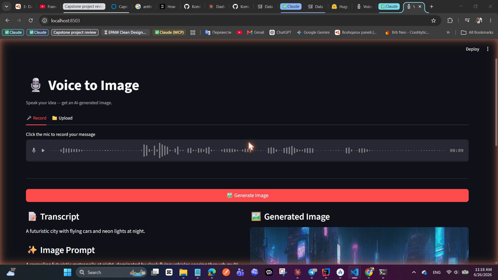
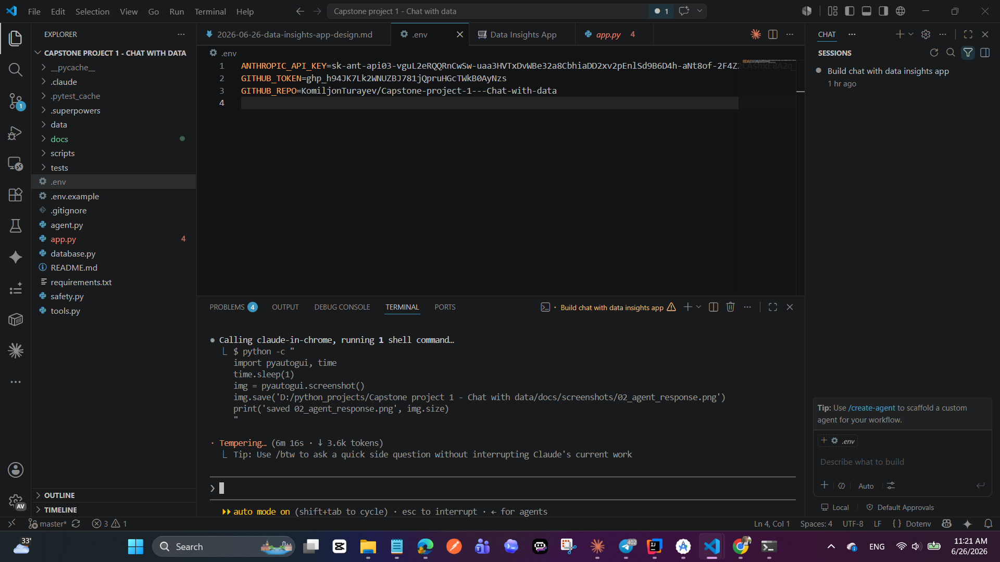
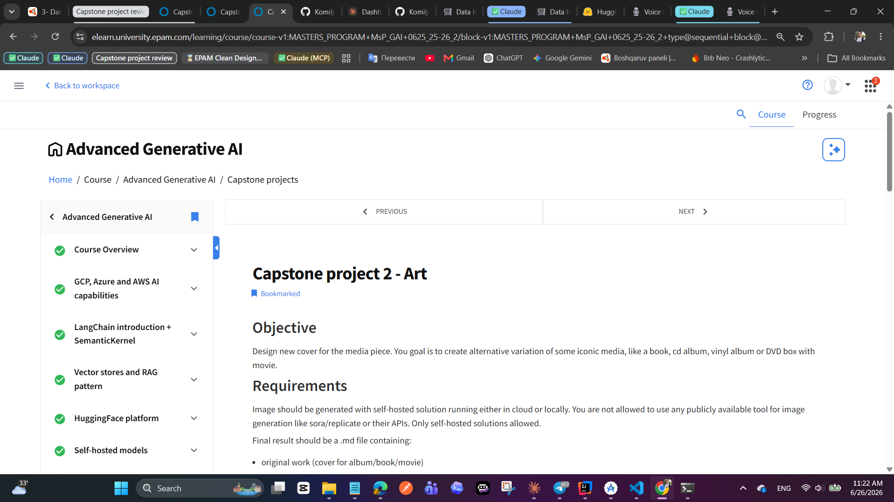

# 🛒 Data Insights App — Chat with your E-commerce Data

A Streamlit chatbot powered by Claude that lets you query an e-commerce SQLite database using plain language. No SQL knowledge required.

## Features

- **Natural language queries** — Ask anything about orders, products, customers
- **Business dashboard** — Live stats and category revenue chart in the sidebar
- **Safety layer** — DELETE, DROP, UPDATE and other destructive operations are blocked at code level
- **Support tickets** — Open a GitHub Issue directly from the chat
- **Console logging** — Every tool call and DB query is logged to the terminal
- **Function calling** — Claude uses 3 tools: `get_schema`, `query_database`, `create_github_issue`

## Setup

### 1. Clone the repo

```bash
git clone https://github.com/YOUR_USERNAME/YOUR_REPO.git
cd YOUR_REPO
```

### 2. Install dependencies

```bash
pip install -r requirements.txt
```

### 3. Configure environment variables

```bash
cp .env.example .env
```

Edit `.env`:

```
ANTHROPIC_API_KEY=your_anthropic_api_key
GITHUB_TOKEN=your_github_personal_access_token
GITHUB_REPO=owner/repository-name
```

- Get an Anthropic API key at https://console.anthropic.com
- Get a GitHub token at GitHub → Settings → Developer settings → Personal access tokens → Tokens (classic) — grant `repo` scope

### 4. Seed the database

```bash
python scripts/seed_data.py
```

Expected output:
```
Creating tables...
Seeding customers...
Seeding products...
Seeding orders and order_items...
Done! {'customers': 200, 'products': 55, 'orders': 300, 'order_items': 880+}
```

### 5. Run the app

```bash
streamlit run app.py
```

Open http://localhost:8501 in your browser.

## Running Tests

```bash
pytest tests/ -v
```

Expected: 27 tests pass.

## Workflow Example

### Step 1: App opens with dashboard

The sidebar shows live dataset statistics, a bar chart of revenue by product category, and sample query buttons.



### Step 2: Ask a question using sample queries or free text

Click any sample query button or type your own question. The agent calls `get_schema()` then `query_database()` and returns formatted results with key insights.



Console output:
```
[2026-06-26 10:23:01] [USER    ]  Who are the top 5 most active customers?
[2026-06-26 10:23:01] [TOOL    ]  get_schema()
[2026-06-26 10:23:02] [TOOL    ]  query_database(SELECT c.id, c.name, c.city ...
[2026-06-26 10:23:02] [DB      ]  5 rows returned
[2026-06-26 10:23:03] [AGENT   ]  Response sent to UI
```

### Step 3: Open a support ticket

Click "Open Support Ticket" button — a form appears pre-filled with context. Click "Create GitHub Issue" to escalate to a human.



## Architecture

```
User (browser) → Streamlit (app.py) → Agent (agent.py) → Claude API
                                                        ↓
                                              Tools (tools.py)
                                    ┌──────────┬──────────┬────────────┐
                                 get_schema  query_db  github_issue
                                               ↓
                                         safety.py (SQL validator)
                                               ↓
                                        SQLite (data/ecommerce.db)
```

## File Structure

```
├── app.py              # Streamlit UI entry point
├── agent.py            # Claude API + tool dispatch loop
├── tools.py            # Tool implementations + Anthropic schemas
├── database.py         # SQLite connection helper
├── safety.py           # SQL keyword validator (blocks destructive ops)
├── data/
│   └── ecommerce.db    # SQLite database (seeded, gitignored)
├── scripts/
│   └── seed_data.py    # Populates database with 1000+ rows via Faker
├── tests/              # pytest test suite (27 tests)
├── .env.example        # Environment variable template
└── requirements.txt
```

## Safety

Two-layer protection against destructive database operations:

1. **System prompt** — Claude is instructed never to generate DELETE/DROP/UPDATE/INSERT/ALTER/TRUNCATE/CREATE/REPLACE SQL
2. **Code validator** — `safety.py` checks every SQL string before execution and logs blocked attempts with `[SAFETY BLOCKED]`

## Deploying to HF Spaces

1. Push this repo to Hugging Face Hub as a Space (SDK: Streamlit)
2. Add secrets in Space settings → Repository secrets:
   - `ANTHROPIC_API_KEY`
   - `GITHUB_TOKEN`
   - `GITHUB_REPO`
3. Run the seed script once in the Space terminal or commit `data/ecommerce.db` directly
4. The app starts automatically — no build step needed
